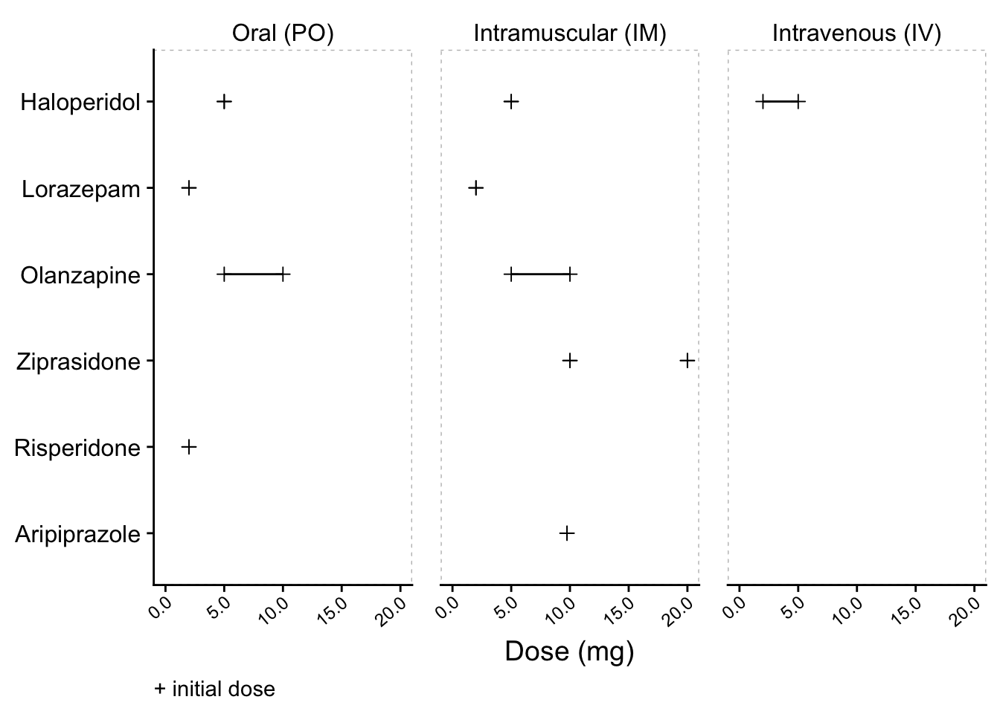
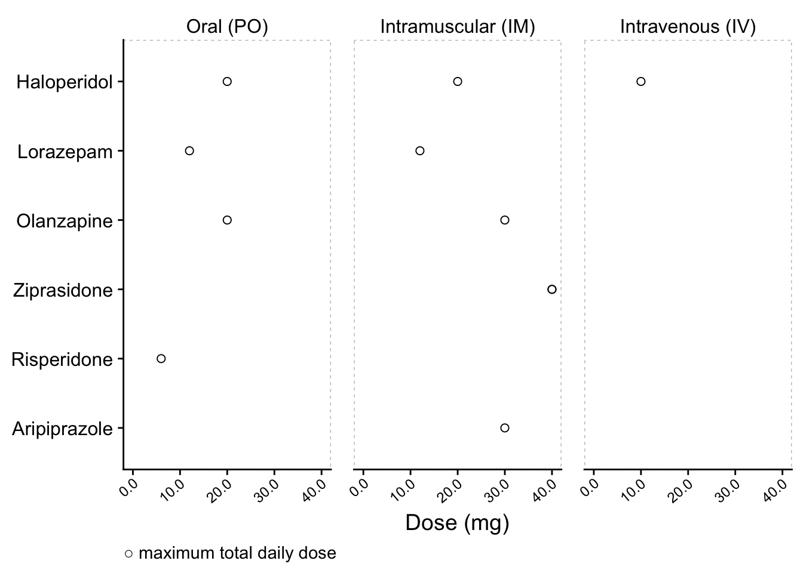
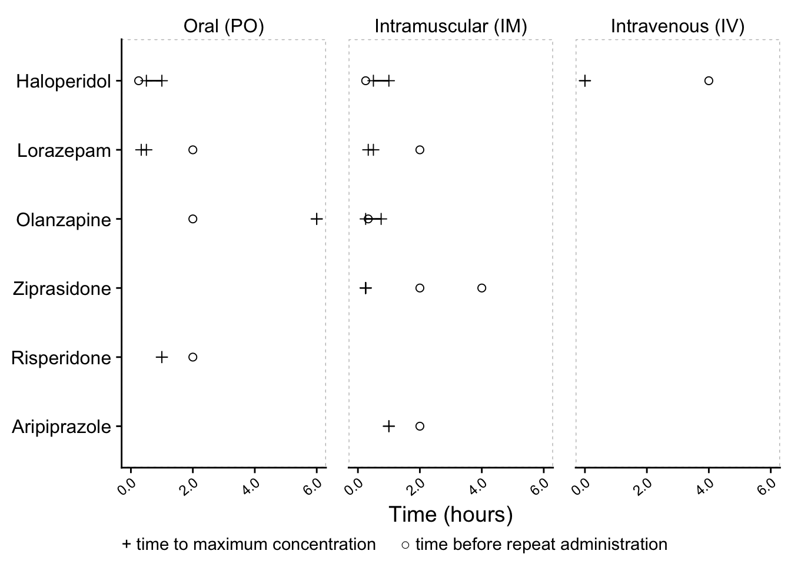
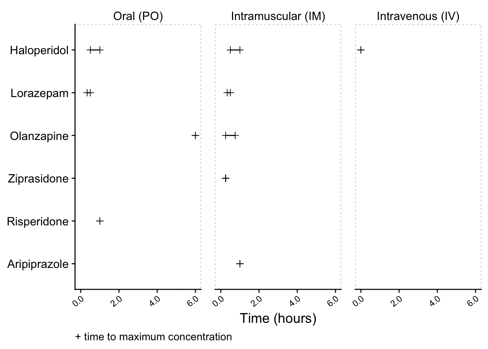
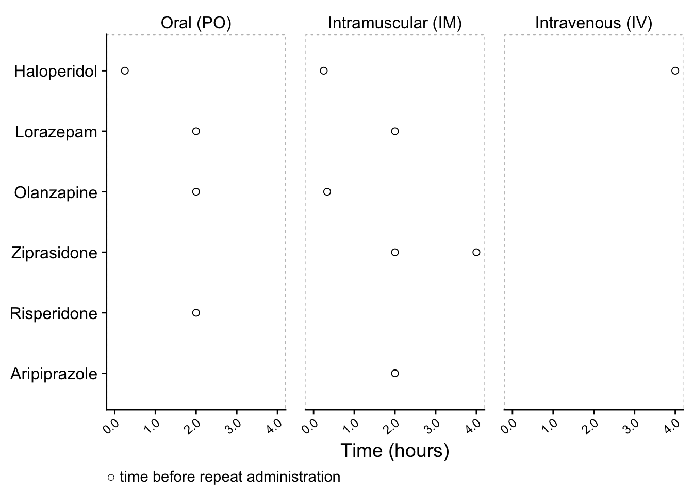

```{=html}
<div style="text-align: center;">
<hr/>

<hr/>
</div>
```

**[Download Flashcards](flashcards/agitation_psychopharmacology_20231215.apkg)** for Anki


<table class="table" style="margin-left: auto; margin-right: auto;border-bottom: 0;">
 <thead>
  <tr>
   <th style="text-align:left;"> Generic (Route) </th>
   <th style="text-align:left;"> Brand </th>
   <th style="text-align:center;"> Initial Dose (mg) </th>
   <th style="text-align:center;"> Max Total Daily Dose (mg) </th>
   <th style="text-align:center;"> Time to Max Concentration (min) </th>
   <th style="text-align:center;"> Time Before Repeat Administration (min) </th>
  </tr>
 </thead>
<tbody>
  <tr grouplength="4"><td colspan="6" style="border-bottom: 1px solid;">Oral</td></tr>
<tr>
   <td style="text-align:left;padding-left: 2em;" indentlevel="1"> Risperidone (PO) </td>
   <td style="text-align:left;"> Risperdal<sup>®</sup> </td>
   <td style="text-align:center;"> 2 </td>
   <td style="text-align:center;"> 6 </td>
   <td style="text-align:center;"> 60 </td>
   <td style="text-align:center;"> 120 </td>
  </tr>
  <tr>
   <td style="text-align:left;padding-left: 2em;" indentlevel="1"> Olanzapine (PO) </td>
   <td style="text-align:left;"> Zyprexa<sup>®</sup> </td>
   <td style="text-align:center;"> 5 – 10 </td>
   <td style="text-align:center;"> 20 </td>
   <td style="text-align:center;"> 360 </td>
   <td style="text-align:center;"> 120 </td>
  </tr>
  <tr>
   <td style="text-align:left;padding-left: 2em;" indentlevel="1"> Haloperidol (PO)<sup>*</sup> </td>
   <td style="text-align:left;"> Haldol<sup>®</sup> </td>
   <td style="text-align:center;"> 5 </td>
   <td style="text-align:center;"> 20 </td>
   <td style="text-align:center;"> 30 – 60 </td>
   <td style="text-align:center;"> 15 </td>
  </tr>
  <tr>
   <td style="text-align:left;padding-left: 2em;" indentlevel="1"> Lorazepam (PO) </td>
   <td style="text-align:left;"> Ativan<sup>®</sup> </td>
   <td style="text-align:center;"> 2 </td>
   <td style="text-align:center;"> 12 </td>
   <td style="text-align:center;"> 20 – 30 </td>
   <td style="text-align:center;"> 120 </td>
  </tr>
  <tr grouplength="6"><td colspan="6" style="border-bottom: 1px solid;">Intramuscular</td></tr>
<tr>
   <td style="text-align:left;padding-left: 2em;" indentlevel="1"> Lorazepam (IM) </td>
   <td style="text-align:left;"> Ativan<sup>®</sup> </td>
   <td style="text-align:center;"> 2 </td>
   <td style="text-align:center;"> 12 </td>
   <td style="text-align:center;"> 20 – 30 </td>
   <td style="text-align:center;"> 120 </td>
  </tr>
  <tr>
   <td style="text-align:left;padding-left: 2em;" indentlevel="1"> Ziprasidone (IM) </td>
   <td style="text-align:left;"> Geodon<sup>®</sup> </td>
   <td style="text-align:center;"> 10 </td>
   <td style="text-align:center;"> 40 </td>
   <td style="text-align:center;"> 15 </td>
   <td style="text-align:center;"> 120 </td>
  </tr>
  <tr>
   <td style="text-align:left;padding-left: 2em;" indentlevel="1"> Ziprasidone (IM) </td>
   <td style="text-align:left;"> Geodon<sup>®</sup> </td>
   <td style="text-align:center;"> 20 </td>
   <td style="text-align:center;"> 40 </td>
   <td style="text-align:center;"> 15 </td>
   <td style="text-align:center;"> 240 </td>
  </tr>
  <tr>
   <td style="text-align:left;padding-left: 2em;" indentlevel="1"> Olanzapine (IM) </td>
   <td style="text-align:left;"> Zyprexa<sup>®</sup> </td>
   <td style="text-align:center;"> 5 – 10 </td>
   <td style="text-align:center;"> 30 </td>
   <td style="text-align:center;"> 15 – 45 </td>
   <td style="text-align:center;"> 20 </td>
  </tr>
  <tr>
   <td style="text-align:left;padding-left: 2em;" indentlevel="1"> Aripiprazole (IM) </td>
   <td style="text-align:left;"> Abilify<sup>®</sup> </td>
   <td style="text-align:center;"> 9.75 </td>
   <td style="text-align:center;"> 30 </td>
   <td style="text-align:center;"> 60 </td>
   <td style="text-align:center;"> 120 </td>
  </tr>
  <tr>
   <td style="text-align:left;padding-left: 2em;" indentlevel="1"> Haloperidol (IM)<sup>*</sup> </td>
   <td style="text-align:left;"> Haldol<sup>®</sup> </td>
   <td style="text-align:center;"> 5 </td>
   <td style="text-align:center;"> 20 </td>
   <td style="text-align:center;"> 30 – 60 </td>
   <td style="text-align:center;"> 15 </td>
  </tr>
  <tr grouplength="1"><td colspan="6" style="border-bottom: 1px solid;">Intravenous</td></tr>
<tr>
   <td style="text-align:left;padding-left: 2em;" indentlevel="1"> Haloperidol (IV)<sup>*</sup><sup>†</sup> </td>
   <td style="text-align:left;"> Haldol<sup>®</sup> </td>
   <td style="text-align:center;"> 2 – 5 </td>
   <td style="text-align:center;"> 10 </td>
   <td style="text-align:center;"> 0 </td>
   <td style="text-align:center;"> 240 </td>
  </tr>
</tbody>
<tfoot>
<tr><td style="padding: 0; " colspan="100%">
<sup>*</sup> Likely to cause higher incidence of extrapyramidal side effects than other recommended drugs</td></tr>
<tr><td style="padding: 0; " colspan="100%">
<sup>†</sup> Administering haloperidol intravenously increases risk of QT prolongation. Avoid if possible, especially in patients w/ borderline QT or taking other medication that can prolong QT. If given IV, limit dose and provide cardiac monitoring.</td></tr>
</tfoot>
</table>


## Dosing {.tabset}

### Composite



### + Initial Dose



### ○ Max Total Daily Dose



## Timing {.tabset}

### Composite



### + Time to Max Concentration



### ○ Time Before Repeat Administration


## 

## References

* Wilson, M. P. <a href="https://doi.org/10.5811/westjem.2011.9.6866">The Psychopharmacology of Agitation: Consensus Statement of the American Association for Emergency Psychiatry Project BETA Psychopharmacology Workgroup</a> (2012)

* Benajah, N. <a href="https://unsplash.com/photos/mans-face-with-white-scarf-5_gku5Usbzk">Man’s Face with White Scarf</a> (2020)
